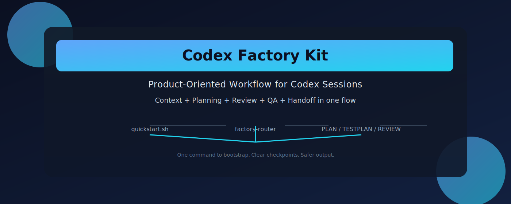

# Codex Factory Kit

<div align="center">
  
</div>

Codex Factory Kit は、実際の repo で Codex を使いながら、毎回「プロンプトを投げて文脈を作り直す」運用から抜けたい人向けの workflow kit です。

Languages: [English](README.md) | [繁體中文](README.zh-TW.md) | [简体中文](README.zh-CN.md) | [日本語](README.ja.md) | [한국어](README.ko.md)

skills、templates、そして推奨される `AGENTS.md` policy を `~/.codex/` に入れ、Codex がより明確に計画し、検証し、review し、repo に作業記憶を残せるようにします。

作業のほとんどがごく小さな 1 ファイル修正なら、少し重いかもしれません。逆に、複数ステップのタスク、review / QA の証拠、複数 session にまたがる作業が多いなら、この kit は役に立ちます。

## 30 秒で分かること

- これは何か：
  Codex 用の workflow kit です。app でも daemon でも IDE plugin でもありません。
- 何が入るか：
  `~/.codex/skills/`、`~/.codex/templates/factory/`、そして `~/.codex/AGENTS.factory-kit.md` です。
- 何を解決するか：
  Codex は session ごとに文脈を作り直し、planning が暗黙になり、QA / review の証拠が弱くなりがちです。この kit はそれを明示的な流れに変えます。
- 実際に何が得られるか：
  repo の `.codex/context/` に `PLAN.md`、`TESTPLAN.md`、`REVIEW.jsonl`、`RELEASE.md`、`RETRO.md`、`LEARNINGS.jsonl` を残せます。

## 初心者向けセットアップ（コピー/ペーストのみ）

開発経験が少なくても、この 2 行で始められます。

```bash
cd /path/to/codex-factory-kit
./quickstart.sh --repo /path/to/your/repo
```

この1コマンドで自動実行される内容:

1. 未導入なら kit をインストール
2. 対象 repo の context を初期化
3. Codex に最初に伝える一文を表示

対象 repo が今いるフォルダなら、`--repo` を省略して実行します。

```bash
cd /path/to/your/repo
/path/to/codex-factory-kit/quickstart.sh
```

推奨 policy をすぐ有効化したい場合は `--adopt-policy` を付けます。

```bash
./quickstart.sh --repo /path/to/your/repo --adopt-policy
```

kit がすでに入っている場合は、初期化だけするために `--skip-install` を使います。

```bash
./quickstart.sh --repo /path/to/your/repo --skip-install
```

フラグの見分け方:

- `--repo PATH`: 実行対象の repo を明示指定
- `--repo` 未指定: 実行している現在のフォルダを対象
- `--adopt-policy`: `~/.codex/AGENTS.md` を推奨 policy で上書き
- `--adopt-policy` 未指定: 既存の `~/.codex/AGENTS.md` は変更しない

## 30秒チェックリスト

```text
1) `cd /path/to/codex-factory-kit`
2) `./quickstart.sh --repo /path/to/your/repo`
3) すぐに推奨 policy を有効化したい場合は `--adopt-policy` を追加
4) 対象 repo が現在のフォルダなら `--repo` は省略
```

- `--repo PATH`: 対象 repo を明示的に指定
- `--repo` 未指定: 実行中のフォルダを対象 repo として使う
- `--adopt-policy`: `~/.codex/AGENTS.md` をすぐ上書きして有効化
- `--adopt-policy` 未指定: 既存の `~/.codex/AGENTS.md` は維持

## 最初に内部ファイルを理解する必要はありません

`.codex/context/`、隠しディレクトリ、`AGENTS.md`、`gitignore` を理解してから始める必要はありません。

最初の導入は次の順番で十分です。

1. kit をインストールする
2. 必要なら推奨 policy を有効化する
3. 対象 repo で 1 つの初期化コマンドを実行する
4. Codex に「まず計画してから実装して」と伝える

## どんな人に向いているか

次に当てはまるなら有効です。

- Codex を実際の repo で使っている
- 実装前に推奨ルートを決めたい
- planning、review、QA、documentation を session をまたいで蓄積したい
- 高リスク作業に対してより明確な gate と境界がほしい
- 作業が複数 session にまたがることが多い

逆に、次ならあまり向きません。

- ほとんどがごく小さな 1 ファイル修正
- repo に永続的な workflow artifact を置きたくない
- Codex に素早く patch だけ作ってほしい

## 何が変わるのか

この kit がないと、次のことが暗黙のまま残りがちです。

- 今回のタスク範囲
- 何を検証したか
- review で何が見つかったか
- 次回も覚えておくべきこと

この kit を使うと、Codex はそれを repo-local artifact にできます。

- `PRODUCT.md`：依頼が曖昧なときに問題を明確化
- `PLAN.md`：実行計画
- `TESTPLAN.md`：検証範囲と証拠
- `REVIEW.jsonl`：review findings と gate 状態
- `RELEASE.md`：挙動や setup の変更
- `RETRO.md`：どこで詰まったか、何が遅かったか
- `LEARNINGS.jsonl`：今後も再利用する guidance
- `FREEZE.md`：高リスクで範囲を狭く保ちたい変更の境界

## インストール方法を 1 つ選ぶ

repo を clone したら、次のどちらかを選びます。

- インストールだけ行う：

```bash
./install.sh
```

- インストールして推奨 policy も有効化する：

```bash
./install.sh --adopt-policy
```

どちらでも次が入ります。

- `skills/*` -> `~/.codex/skills/`
- `templates/factory/*` -> `~/.codex/templates/factory/`
- `AGENTS.md` -> `~/.codex/AGENTS.factory-kit.md`
- `VERSION` と `CHANGELOG.md` -> `~/.codex/factory-kit/`

安全なルートでは既存の `~/.codex/AGENTS.md` は上書きしません。
有効化ルートでは推奨 policy を `~/.codex/AGENTS.md` にそのまま書き込みます。

フラグの違いはこれだけ覚えておけばOK：

- `./install.sh`：キットのみをインストールし、既存の `~/.codex/AGENTS.md` は変更しません。
- `./install.sh --adopt-policy`：キットをインストールし、推奨 policy を `~/.codex/AGENTS.md` に即時反映して Codex の既定設定として使います。

後からインストール状態を確認したい場合は次を使います。

```bash
./skills/factory-kit-upgrade/scripts/factory-kit-upgrade.sh status
./skills/factory-kit-upgrade/scripts/factory-kit-upgrade.sh check-updates
```

## 3 分で始める

1. kit をインストールします。

```bash
git clone https://github.com/kevintseng/codex-factory-kit.git
cd codex-factory-kit
./install.sh --adopt-policy
```

policy を先に確認したいなら `./install.sh` を使ってください。

2. 使いたい repo で次を実行します。

```bash
~/.codex/factory-kit/init-repo.sh
```

これで不足している context ファイルが作成され、`.gitignore` も更新されます。

現在のディレクトリが対象 repo でない場合は `~/.codex/factory-kit/init-repo.sh --repo /path/to/repo` を使ってください。

bootstrap の挙動:

- `--repo` を省略：今いるディレクトリを初期化します。
- `--repo /path/to/repo`：別の指定パスを初期化します（他の場所から実行する場合に便利）。

3. その repo で Codex を開き、最初にこう伝えます。

```text
Plan this task before coding. Keep the workflow lightweight unless risk justifies more.
```

4. もしユーザーフローが変わるなら、次も追加します。

```text
This changes a browser or runtime flow. Verify it before we call it done.
```

この kit を初めて使うなら、初日はここまでで十分です。まずは install、repo の初期化、そして Codex に「先に plan してから実装して」と伝えるだけで始められます。下の高度なセクションは、作業が大きくなったりリスクが上がったときに読めば十分です。

## 日常の最小運用

小さなタスクなら：

1. まず計画してから実装すると伝える
2. repo の plan を更新させる
3. 実装する
4. リスクが上がらない限り、それ以上は増やさない

大きいタスクや高リスクタスクなら：

1. repo が未初期化なら先に bootstrap する
2. まず今回のタスクをどう進めるか分類させる
3. 要件が曖昧なら先に問題を整理する
4. `PLAN.md` と `TESTPLAN.md` を作らせる
5. 高リスクで範囲を絞りたいなら先に境界を固定する
6. 実装
7. 必要なら越境していないか確認
8. 構造化 review
9. runtime / browser 証拠が必要なら検証
10. 挙動や setup が変わったら docs や release notes を更新
11. `retro`
12. 再利用価値があるなら learning を残す

上級者向け対応表：

- タスク分類：`factory-router`
- 計画作成：`sprint-conductor`
- 構造化 review：`review-gate`
- runtime 検証：`qa-runtime`

## 含まれているもの

- Codex 用のグローバル skills:
  - `bootstrap-context`
  - `factory-router`
  - `factory-kit-upgrade`
  - `freeze`
  - `guard`
  - `founder-review`
  - `eng-review`
  - `design-review`
  - `security-review`
  - `release-review`
  - `learn`
  - `office-hours-codex`
  - `sprint-conductor`
  - `review-gate`
  - `qa-runtime`
  - `document-release`
  - `retro`
- factory templates:
  - `PRODUCT.md`
  - `PLAN.md`
  - `TESTPLAN.md`
  - `REVIEW.jsonl.example`
  - `RELEASE.md`
  - `RETRO.md`
  - `LEARNINGS.jsonl.example`
  - `FREEZE.md`
- 推奨されるグローバル `AGENTS.md` policy
- `~/.codex` に skills と templates をコピーする installer
- `docs/generated/` に置かれる generated contract references

## なぜこのフローが必要か

要点は単純です。毎回タスクを言い直すより、持続する artifact の方が強いからです。

Codex に毎回短期コンテキストだけでプロジェクト全体を覚えさせるのではなく、repo 内の `.codex/context/` に作業 artifact を置きます。これにより、引き継ぎ、review、QA、継続作業がかなり安定します。

## ワークフローの形

```text
曖昧な依頼
  -> factory-router
  -> office-hours-codex
  -> PRODUCT.md
  -> sprint-conductor
  -> PLAN.md + TESTPLAN.md
  -> optional freeze
  -> implementation
  -> optional guard
  -> review-gate
  -> qa-runtime
  -> document-release
  -> retro
  -> optional learn
```

## Repo ごとの導入

デフォルトの導入方法：

```bash
~/.codex/factory-kit/init-repo.sh
```

これで不足している repo-local artifact が作られ、既存内容は上書きされません。

手動で行いたい場合の fallback：

```bash
mkdir -p .codex/context
cp ~/.codex/templates/factory/PRODUCT.md .codex/context/PRODUCT.md
cp ~/.codex/templates/factory/PLAN.md .codex/context/PLAN.md
cp ~/.codex/templates/factory/TESTPLAN.md .codex/context/TESTPLAN.md
cp ~/.codex/templates/factory/RELEASE.md .codex/context/RELEASE.md
cp ~/.codex/templates/factory/RETRO.md .codex/context/RETRO.md
: > .codex/context/REVIEW.jsonl
: > .codex/context/LEARNINGS.jsonl
printf '\n.codex/context/\n' >> .gitignore
```

## タスクフロー例

例: Codex に不安定な checkout route の修正を依頼する場合。

workflow layer がないと:

- agent がすぐに code patch に入るかもしれない
- tests や runtime verification が暗黙のまま省略されるかもしれない
- 次の session で何が変わり何がリスクなのかを再構築し直す必要がある

Codex Factory Kit を使うと:

1. `sprint-conductor` が具体的な `PLAN.md` を書く
2. `review-gate` が findings を `REVIEW.jsonl` に記録する
3. `qa-runtime` が実行時検証の証拠を `TESTPLAN.md` に残す
4. `document-release` が必要なら release notes を更新する
5. `retro` が何が作業を遅くしたかを残す
6. `learn` が再利用できる教訓を `LEARNINGS.jsonl` に昇格する
7. 次の類似タスクでは `learn sync-context` で関連 guidance を `PLAN.md` と `TESTPLAN.md` に戻す

より具体的な例は [docs/examples.md](docs/examples.md) を参照してください。

## Factory Router

`factory-router` は、公開 kit に入った最初の正式な vNext capability です。

実装前に次を判断します。

- lightweight mode か full mode か
- `office-hours-codex`、`review-gate`、`qa-runtime`、`document-release`、`retro` が必要か
- 危険な作業を狭い範囲に閉じ込めるために `freeze` / `guard` を使うべきか
- 作業をローカルの critical path に残すべきか、bounded parallel slices に分けられるか
- どの model class がルーティング、統合、ゲートを主導し、どの class が bounded work を安全に実行できるか

これは hidden automation ではなく soft orchestration です。Codex に正しい workflow と quality bar を選ばせるためのものであり、危険な操作をプラットフォームレベルで自動実行すると主張するものではありません。

## Freeze And Guard

kit には基本的な safety layer も含まれます。

- `freeze` は allowed paths、blocked paths、protected invariants を持つ `.codex/context/FREEZE.md` を作ります
- `guard` は最終ゲート前に現在の diff がその freeze contract を守ったかを検証します

これは大きな repo で「高リスクだが範囲は小さく保ちたい」作業向けであり、すべての小修正に必要なものではありません。

## Governance Role Packs

kit には `review-gate` の上に重ねる薄い governance overlays も含まれます。

- `founder-review`
- `eng-review`
- `design-review`
- `security-review`
- `release-review`

これらは新しいメインフローではなく、異なる出荷判断の視点を追加する review lens です。

## Learning Layer

kit には最初の learning layer も含まれます。

- `learn` は再利用できる guidance を `.codex/context/LEARNINGS.jsonl` に昇格します
- learning store は repo-local で、タスクをまたいで使い回せます
- 新しいタスク向けに relevant な learning を参照したり、planning artifact に反映したり、古くなった guidance を無効化できます

これは自由形式のメモ置き場ではありません。今後の routing、review、QA、release、safety の判断を変えるための再利用可能な guidance です。

新しいタスクが既存の guidance に合う場合は、次を使えます。

```bash
python3 ~/.codex/skills/learn/scripts/factory-kit-learn.py sync-context \
  --task-class ui_workflow \
  --tag browser
```

これにより `.codex/context/PLAN.md` と `.codex/context/TESTPLAN.md` の `Relevant Learnings` セクションが更新されます。

## Versioning、Release Check、Upgrade

kit にはローカル upgrade foundation と最初の release-check layer も含まれます。

- repo ルートの `VERSION`
- repo ルートの `CHANGELOG.md`
- `~/.codex/factory-kit/` に入る installed metadata
- `factory-kit-upgrade` skill と script

現時点でできること:

- repo version と installed version の表示
- ローカル version と最新の公開 GitHub release の比較
- `~/.codex/factory-kit/update-state.json` への update-check state の保存
- 対象 `CODEX_HOME` の検出
- 利用可能なら install metadata に保存された source checkout path の再利用
- 現在の repo checkout から installed skill pack と templates を更新

現時点でまだしないこと:

- 明示コマンドなしの自動 upgrade
- proactive な update prompt や snooze
- repo-local `.codex/context/` artifact の書き換え
- `~/.codex/AGENTS.md` の上書き

install を変更せずに最新の公開 version だけ確認したいなら、次を実行します。

```bash
./skills/factory-kit-upgrade/scripts/factory-kit-upgrade.sh check-updates
```

現在の repo checkout が installed version より古い場合、`upgrade` はデフォルトで上書きを拒否し、実行には明示的な `--allow-downgrade` が必要です。

## デフォルトループ

タスクが多段階、高リスク、または複数 surface にまたがる場合は full loop を使います。

1. `bootstrap-context`
2. 経路が明確でないなら `factory-router`
3. 要件が曖昧なら `office-hours-codex`
4. blast radius を狭く保つ必要があるなら `freeze`
5. `sprint-conductor`
6. repo-local agents による実装
7. freeze contract があるなら `guard`
8. `review-gate`
9. `qa-runtime`
10. `document-release`
11. `retro`

## Lightweight Mode

次がすべて当てはまるなら lightweight mode を使います。

- 変更が小さく境界が明確
- browser や multi-surface verification が明らかに不要
- infra、migration、legal、security、fintech のリスクがない

lightweight mode では:

1. 依頼が曖昧でない限り `office-hours-codex` を省略
2. `sprint-conductor` で `PLAN.md` だけ更新
3. タスクが膨らまない限り `TESTPLAN.md`、`RELEASE.md`、`RETRO.md` を省略
4. ごく小さな変更では、リスクが上がらない限り `review-gate` を省略

## Repo-Local Agents

この repo には、あなたの各プロジェクト固有の specialist pack は含みません。

意図している分離は次の通りです。

- 共通 workflow skills は `~/.codex/skills/`
- project-specific agents は `<repo>/.codex/agents/`
- working memory は `<repo>/.codex/context/`

この分離によって、私的なプロジェクト文脈を漏らさずに再利用可能な operating model だけを公開できます。

## 公開前提の設計

この repo には意図的に次を含めていません。

- private project prompts
- repo-local domain agent packs
- personal logs、sessions、auth、Codex state
- private repo の app-specific code

含まれているのは再利用可能な workflow layer だけです。

## ディレクトリ構成

```text
.
├── VERSION
├── CHANGELOG.md
├── AGENTS.md
├── install.sh
├── skills/
│   ├── bootstrap-context/
│   ├── factory-router/
│   ├── factory-kit-upgrade/
│   ├── freeze/
│   ├── guard/
│   ├── office-hours-codex/
│   ├── sprint-conductor/
│   ├── review-gate/
│   ├── qa-runtime/
│   ├── document-release/
│   └── retro/
├── docs/
│   ├── adoption.md
│   ├── examples.md
│   └── share.md
└── templates/
    └── factory/
        └── FREEZE.md
```

## ドキュメント

- [Adoption notes](docs/adoption.md)
- [Usage examples](docs/examples.md)
- [Share copy](docs/share.md)

## License

MIT
